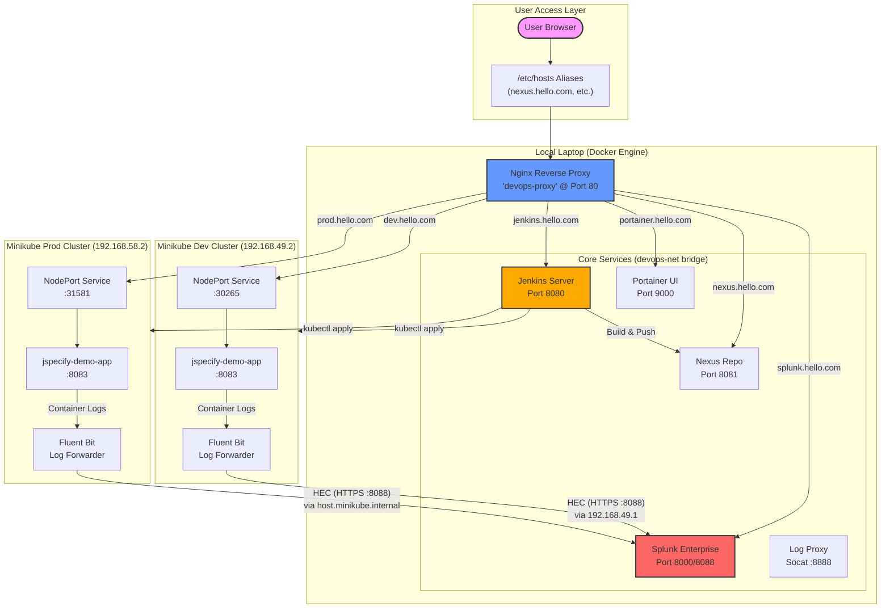

# Infrastructure Backup & Restore Guide

## System Architecture



This directory contains a complete backup of the DevOps infrastructure state as of the "first stable state" commit.

## Structure

*   `docker-compose.yaml`: Defines the host-level services (Jenkins, Nexus, Splunk, Portainer, Nginx Proxy). Use `docker-compose up -d` to restore.
*   `nginx/`: Nginx reverse proxy configuration.
*   `fluent-bit/`: Fluent Bit manifests deployed to the **Dev** cluster.
*   `k8s/`:
    *   `dev/`: Deployments and Services running in the `dev` namespace of `dev-cluster`.
    *   `prod/`: Deployments and Services running in the `prod` namespace of `prod-cluster`.
    *   `prod/fluent-bit/`: Fluent Bit manifests running in the `kube-system` namespace of `prod-cluster`.
*   `splunk/`:
    *   `inputs.conf`: The HEC configuration from the Splunk server.
    *   `token.txt`: The specific HEC token used by Fluent Bit.
*   `setup_hosts.sh`: Script to add local DNS aliases to `/etc/hosts`.

## Restoration Steps

1.  **Host Services:**
    ```bash
    cd infra
    docker-compose up -d
    ./setup_hosts.sh
    ```

2.  **Splunk Configuration:**
    *   After Splunk starts, copy `splunk/inputs.conf` to the container:
        ```bash
        docker cp splunk/inputs.conf splunk-server:/opt/splunk/etc/apps/splunk_httpinput/local/
        docker restart splunk-server
        ```

3.  **Kubernetes Clusters (Minikube):**
    *   Ensure clusters are running (`minikube start -p dev-cluster`, `minikube start -p prod-cluster`).
    *   Apply Dev manifests:
        ```bash
        kubectl config use-context dev-cluster
        kubectl apply -f k8s/dev/
        kubectl apply -f fluent-bit/ # Apply Fluent Bit to Dev
        ```
    *   Apply Prod manifests:
        ```bash
        kubectl config use-context prod-cluster
        kubectl apply -f k8s/prod/
        kubectl apply -f k8s/prod/fluent-bit/
        ```
