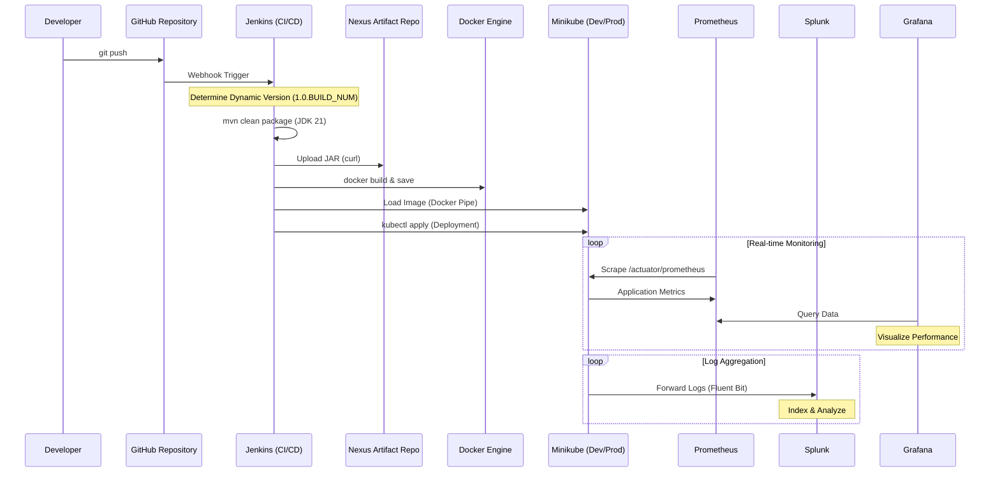

# DevOps End-to-End Data Flow

```mermaid
sequenceDiagram
    participant Dev as Developer
    participant Git as GitHub Repository
    participant Jen as Jenkins (CI/CD)
    participant Nex as Nexus Artifact Repo
    participant Doc as Docker Engine
    participant K8s as Minikube (Dev/Prod)
    participant Prom as Prometheus
    participant Spl as Splunk
    participant Gra as Grafana

    Dev->>Git: git push
    Git->>Jen: Webhook Trigger
    Note over Jen: Determine Dynamic Version (1.0.BUILD_NUM)
    Jen->>Jen: mvn clean package (JDK 21)
    Jen->>Nex: Upload JAR (curl)
    Jen->>Doc: docker build & save
    Jen->>K8s: Load Image (Docker Pipe)
    Jen->>K8s: kubectl apply (Deployment)
    
    loop Real-time Monitoring
        Prom->>K8s: Scrape /actuator/prometheus
        K8s->>Prom: Application Metrics
        Gra->>Prom: Query Data
        Note over Gra: Visualize Performance
    end

    loop Log Aggregation
        K8s->>Spl: Forward Logs (Fluent Bit)
        Note over Spl: Index & Analyze
    end
```
